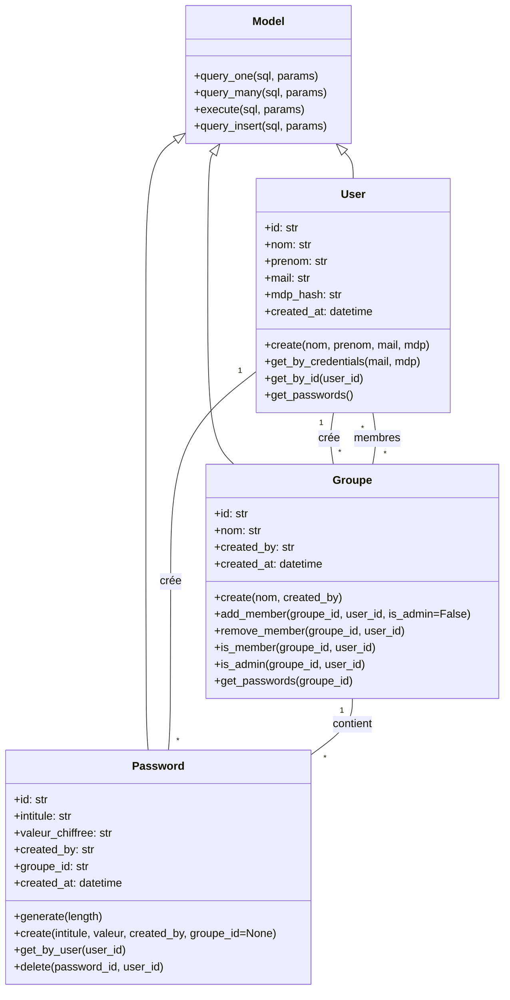

# Documentation du Projet - Gestionnaire de Mots de Passe

## Table des Matières
1. [Architecture du Projet](#architecture-du-projet)
2. [Diagramme de Classes](#diagramme-de-classes)
3. [Modèle de Données](#modèle-de-données)
4. [Fonctionnalités Clés](#fonctionnalités-clés)
5. [Sécurité](#sécurité)
6. [Points d'Extension](#points-dextension)

## Architecture du Projet

```
password_generator/
│
├── models/                 # Modèles de données
│   ├── __init__.py
│   ├── user.py            # Gestion des utilisateurs
│   ├── password.py        # Gestion des mots de passe
│   └── groupe.py          # Gestion des groupes
│
├── database.py            # Connexion et configuration de la base de données
├── main.py                # Point d'entrée de l'application
└── test.py               # Tests unitaires
```

## Diagramme de Classes



## Modèle de Données

### Table: app_user
- `id` (TEXT, PK): Identifiant unique de l'utilisateur
- `nom` (TEXT): Nom de famille
- `prenom` (TEXT): Prénom
- `mail` (TEXT, UNIQUE): Adresse email (utilisée pour la connexion)
- `mdp_hash` (TEXT): Hash du mot de passe (SHA-256)
- `created_at` (TEXT): Date de création (ISO format)

### Table: groupe
- `id` (TEXT, PK): Identifiant unique du groupe
- `nom` (TEXT): Nom du groupe
- `created_by` (TEXT, FK): ID de l'utilisateur créateur
- `created_at` (TEXT): Date de création (ISO format)

### Table: groupe_membre
- `groupe_id` (TEXT, FK): Référence au groupe
- `user_id` (TEXT, FK): Référence à l'utilisateur
- `is_admin` (INTEGER): 1 si administrateur, 0 sinon
- `created_at` (TEXT): Date d'ajout au groupe
- PRIMARY KEY (groupe_id, user_id)

### Table: password
- `id` (TEXT, PK): Identifiant unique du mot de passe
- `intitule` (TEXT): Description/identifiant du mot de passe
- `valeur_chiffree` (TEXT): Mot de passe chiffré
- `created_by` (TEXT, FK): ID de l'utilisateur créateur
- `groupe_id` (TEXT, FK, NULLABLE): Référence au groupe si applicable
- `created_at` (TEXT): Date de création
- `updated_at` (TEXT): Dernière mise à jour

## Fonctionnalités Clés

### 1. Gestion des Utilisateurs
- Création de compte sécurisée
- Authentification par email/mot de passe
- Gestion des sessions

### 2. Gestion des Mots de Passe
- Génération de mots de passe forts
- Stockage sécurisé
- Partage via les groupes
- Historique des modifications

### 3. Gestion des Groupes
- Création et suppression de groupes
- Gestion des droits (admin/membre)
- Partage de mots de passe au sein des groupes

## Sécurité

### Chiffrement
- Hashage des mots de passe avec SHA-256
- Gestion sécurisée des tokens d'authentification

### Contrôle d'Accès
- Vérification systématique des permissions
- Principe du moindre privilège
- Journalisation des accès

### Bonnes Pratiques
- Injection SQL prévenue par l'utilisation de requêtes paramétrées
- Validation des entrées utilisateur
- Gestion appropriée des erreurs

## Points d'Extension

### Évolutions Possibles
1. **Authentification à deux facteurs**
   - Intégration avec Google Authenticator
   - Envoi de codes par SMS/email

2. **Audit de Sécurité**
   - Journalisation des accès
   - Détection d'activité suspecte

3. **Partage Avancé**
   - Droits granulaires (lecture/écriture)
   - Partage avec expiration
   - Révocabilité des accès

4. **Synchronisation Cloud**
   - Sauvegarde chiffrée
   - Accès multi-appareils

5. **Interface Web**
   - Interface réactive
   - Extension navigateur
   - Application mobile

## Conclusion
Ce gestionnaire de mots de passe offre une solution sécurisée et évolutive pour la gestion des identifiants. Son architecture modulaire permet des extensions faciles pour répondre à des besoins spécifiques tout en maintenant un haut niveau de sécurité.
